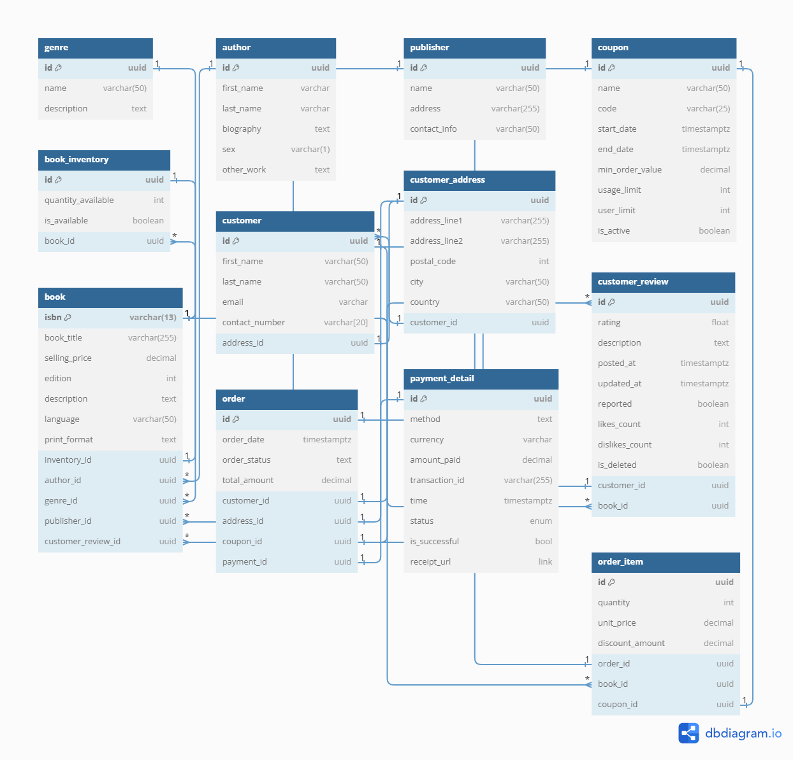
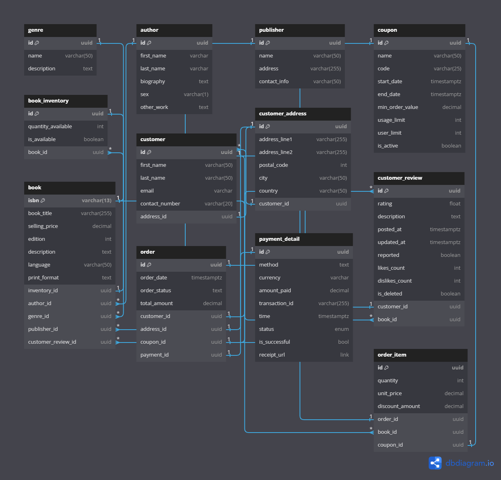

# Bookstore Database Schema

Welcome to the database schema documentation for the Bookstore project. This document provides a comprehensive overview of the database schema designed as part of the blinkit SDE intern application process.

The schema is carefully crafted to facilitate the management of various aspects of a bookstore, including books, authors, publishers, customers, orders, payments, coupons, and reviews. Each table is meticulously designed to capture relevant information and establish relationships between entities, enabling efficient data management and retrieval.

Additionally, this repository includes SQL queries tailored to the specific requirements of the Bookstore project. These queries are designed to retrieve vital information such as top-selling books and total sales revenue within a specified period.

Whether you're exploring the schema for understanding, implementing it in your project, or evaluating it for potential improvements, this documentation serves as a valuable resource to navigate the intricacies of the Bookstore database schema.

## Schema Diagram



## Tables

Here's a detailed list and description of the tables in the provided database schema:

1. **genre**:
   - **Columns**:
     - `id` (Serial): Primary key identifier for the genre.
     - `name` (Varchar): Name of the genre.
     - `description` (Text): Description of the genre.

2. **author**:
   - **Columns**:
     - `id` (Serial): Primary key identifier for the author.
     - `first_name` (Varchar): First name of the author.
     - `last_name` (Varchar): Last name of the author.
     - `biography` (Text): Biography of the author.
     - `sex` (Varchar): Sex of the author.
     - `other_work` (Text): Other works by the author.

3. **publisher**:
   - **Columns**:
     - `id` (Serial): Primary key identifier for the publisher.
     - `name` (Varchar): Name of the publisher.
     - `address` (Varchar): Address of the publisher.
     - `contact_info` (Varchar): Contact information of the publisher.

4. **coupon**:
   - **Columns**:
     - `id` (Serial): Primary key identifier for the coupon.
     - `name` (Varchar): Name of the coupon.
     - `code` (Varchar): Coupon code.
     - `start_date` (Timestamp with timezone): Start date of the coupon validity.
     - `end_date` (Timestamp with timezone): End date of the coupon validity.
     - `min_order_value` (Decimal): Minimum order value required to use the coupon.
     - `usage_limit` (Integer): Limit on the number of times the coupon can be used.
     - `user_limit` (Integer): Limit on the number of times a single user can use the coupon.
     - `is_active` (Boolean): Indicates whether the coupon is active or not.

5. **book_inventory**:
   - **Columns**:
     - `id` (Serial): Primary key identifier for the book inventory.
     - `quantity_available` (Integer): Quantity of books available in the inventory.
     - `is_available` (Boolean): Indicates whether the book is available or not.
     - `book_id` (Varchar): Foreign key reference to the `isbn` column in the `book` table.

6. **customer_address**:
   - **Columns**:
     - `id` (UUID): Primary key identifier for the customer address.
     - `address_line1` (Varchar): Address line 1.
     - `address_line2` (Varchar): Address line 2.
     - `postal_code` (Integer): Postal code.
     - `city` (Varchar): City.
     - `country` (Varchar): Country.

7. **customer**:
   - **Columns**:
     - `id` (UUID): Primary key identifier for the customer.
     - `first_name` (Varchar): First name of the customer.
     - `last_name` (Varchar): Last name of the customer.
     - `email` (Varchar): Email address of the customer (unique constraint).
     - `contact_number` (Varchar): Contact number of the customer.
     - `address_id` (UUID): Foreign key reference to the `id` column in the `customer_address` table.
8. **payment_detail**:
   - **Columns**:
     - `id` (UUID): Primary key identifier for the payment detail.
     - `method` (Text): Payment method used.
     - `currency` (Varchar): Currency used for the payment.
     - `amount_paid` (Decimal): Amount paid for the transaction.
     - `transaction_id` (Varchar): Unique identifier for the transaction (unique constraint).
     - `time` (Timestamp with timezone): Timestamp of the transaction.
     - `status` (Text): Status of the transaction.
     - `is_successful` (Boolean): Indicates whether the transaction was successful or not.
     - `receipt_url` (Text): URL of the transaction receipt.

9. **customer_review**:
   - **Columns**:
     - `id` (Serial): Primary key identifier for the customer review.
     - `rating` (Float): Rating given by the customer.
     - `description` (Text): Description of the review.
     - `posted_at` (Timestamp with timezone): Timestamp when the review was posted.
     - `updated_at` (Timestamp with timezone): Timestamp when the review was last updated.
     - `reported` (Boolean): Indicates whether the review has been reported.
     - `likes_count` (Integer): Number of likes received for the review.
     - `dislikes_count` (Integer): Number of dislikes received for the review.
     - `is_deleted` (Boolean): Indicates whether the review has been deleted.
     - `customer_id` (UUID): Foreign key reference to the `id` column in the `customer` table.

10. **book**:
    - **Columns**:
      - `isbn` (Varchar): Unique identifier for the book (unique constraint).
      - `book_title` (Varchar): Title of the book.
      - `selling_price` (Decimal): Selling price of the book.
      - `edition` (Integer): Edition of the book.
      - `description` (Text): Description of the book.
      - `language` (Varchar): Language of the book.
      - `print_format` (Text): Print format of the book.
      - `inventory_id` (Serial): Foreign key reference to the `id` column in the `book_inventory` table.
      - `author_id` (Serial): Foreign key reference to the `id` column in the `author` table.
      - `genre_id` (Serial): Foreign key reference to the `id` column in the `genre` table.
      - `publisher_id` (Serial): Foreign key reference to the `id` column in the `publisher` table.
      - `customer_review_id` (Serial): Foreign key reference to the `id` column in the `customer_review` table.

11. **order**:
    - **Columns**:
      - `id` (UUID): Primary key identifier for the order.
      - `order_date` (Timestamp with timezone): Timestamp when the order was placed.
      - `order_status` (Text): Status of the order.
      - `total_amount` (Decimal): Total amount of the order.
      - `customer_id` (UUID): Foreign key reference to the `id` column in the `customer` table.
      - `address_id` (UUID): Foreign key reference to the `id` column in the `customer_address` table.
      - `coupon_id` (Serial): Foreign key reference to the `id` column in the `coupon` table.
      - `payment_id` (UUID): Foreign key reference to the `id` column in the `payment_detail` table.

12. **order_item**:
    - **Columns**:
      - `id` (UUID): Primary key identifier for the order item.
      - `quantity` (Integer): Quantity of the book in the order.
      - `unit_price` (Decimal): Unit price of the book in the order.
      - `discount_amount` (Decimal): Discount amount applied to the order item.
      - `order_id` (UUID): Foreign key reference to the `id` column in the `order` table.
      - `book_id` (Varchar): Foreign key reference to the `isbn` column in the `book` table.
      - `coupon_id` (Serial): Foreign key reference to the `id` column in the `coupon` table.

13. **book_customer_review**:
    - **Columns**:
      - `book_customer_review_id` (Varchar): Foreign key reference to the `isbn` column in the `book` table.
      - `customer_review_id` (Serial): Foreign key reference to the `id` column in the `customer_review` table.
    - **Primary Key**: Combination of `book_customer_review_id` and `customer_review_id`.

## Queries

### Query 1: Retrieve Top-Selling Books

This query retrieves the top-selling books for the period from January 1, 2024, to January 31, 2024. It returns the ISBN, title, and total quantity sold for each book, ordered by total sold in descending order.

```sql
SELECT 
    b.isbn, 
    b.book_title, 
    SUM(oi.quantity) AS total_sold
FROM 
    order_item oi
JOIN 
    book b ON oi.book_id = b.isbn
JOIN 
    "order" o ON oi.order_id = o.id
WHERE 
    o.order_date BETWEEN '2024-01-01' AND '2024-01-31' 
    -- It can be replaced with the desired range of dates
GROUP BY 
    b.isbn, 
    b.book_title
ORDER BY 
    total_sold DESC;
-- LIMIT A; We can adjust the limit to get top A selling books. Ex: LIMIT 3 will give top 3 selling books
```

### Query 2: Calculate Total Sales Revenue

This query calculates the total sales revenue for the period from January 1, 2024, to January 31, 2024. It sums the total revenue generated from book sales within the specified period.

```sql
SELECT 
    SUM(oi.quantity * oi.unit_price) AS total_revenue
FROM 
    order_item oi
JOIN 
    "order" o ON oi.order_id = o.id
WHERE 
    o.order_date BETWEEN '2024-01-01' AND '2024-01-31'; 
    -- It can be replaced with the desired range of dates
```

---

> Thank you! Show you support by ⭐ the repository.